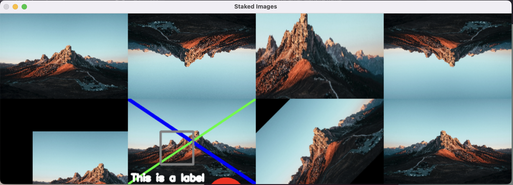
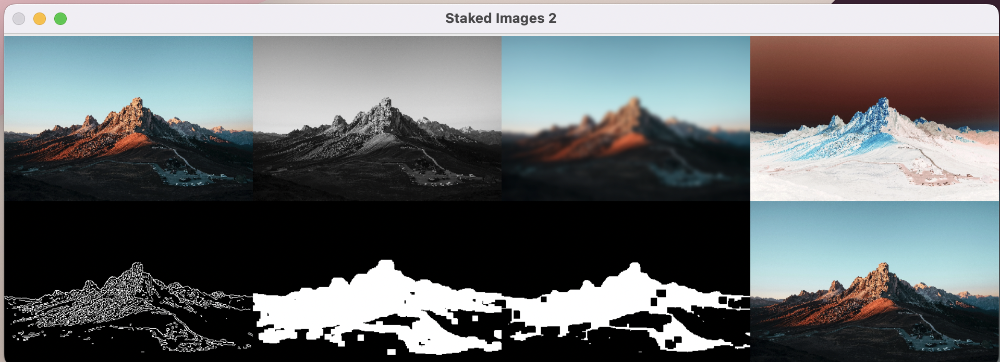
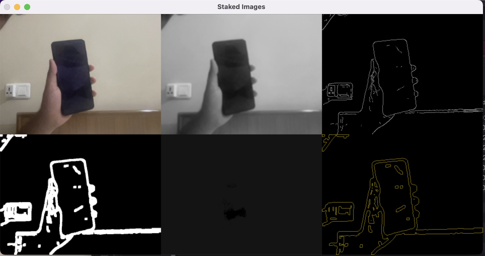
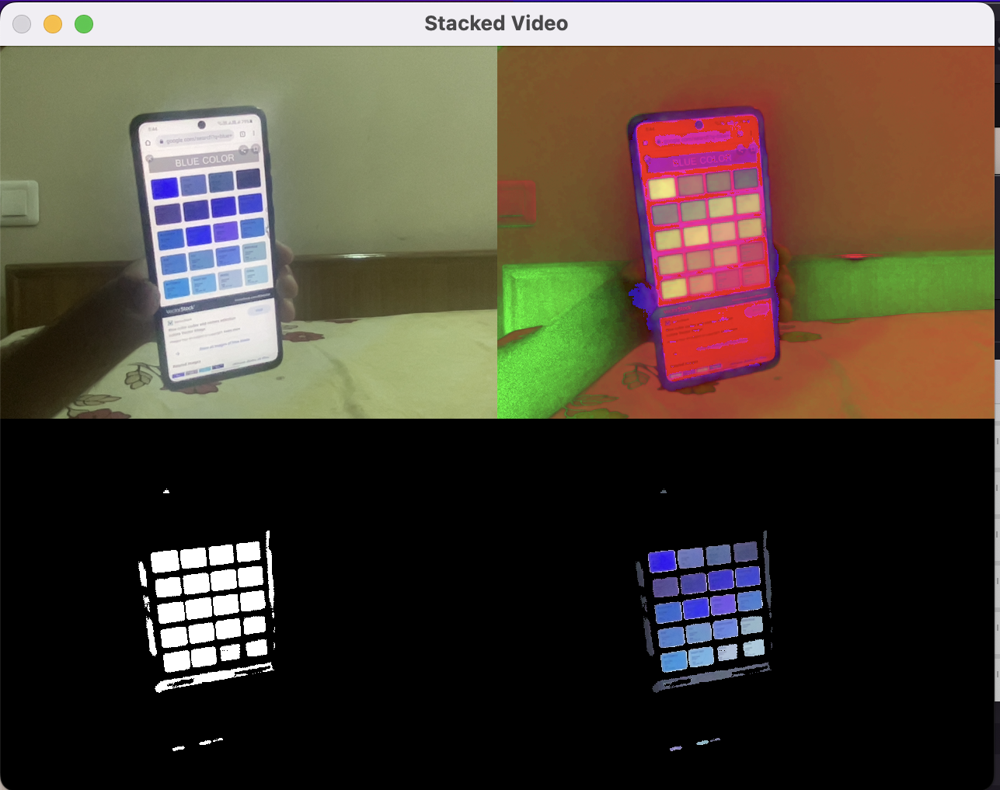
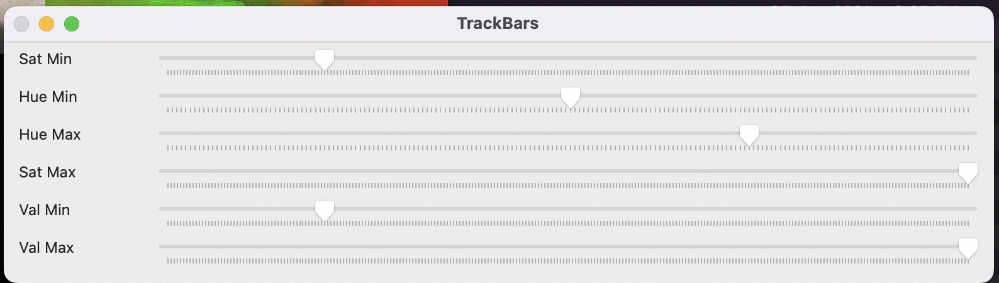

# Open CV Projects

I was always interested in OPENCV. So I learnt the basics and build a color detecton app using it.

### image_basics.py

- Stacked Image shows different edit features (crop, rotote, flip, etc) which can be done via OpenCV. 
    

- Stacked Image 2 shows different basic filters applied on image.
    

### video_basics.py
    
- It played the video and shows how to use webcam. 

### contours.py

- It shows how to find the cotours on the video streamed by webcam. 
    

### color_detection.py

- This was built as a final project.
- It detects the specific color from the video using masking and only shows it.
- It also has gui to choose the color which you want to display.
    

here, it is only showing blue color shade.

